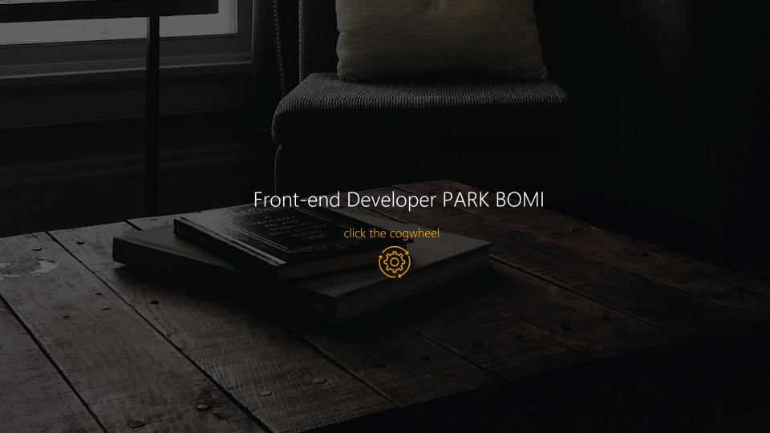

# 목차

- [프로젝트 소개](#프로젝트-소개)
- [사용된 기술 스택](#사용된-기술-스택)
  - [Front-End](#front-end)
- [구현한 기능 목록](#구현한-기능-목록)
- [외부 리소스 정보](#외부-리소스-정보)

 

# 프로젝트 소개

 
 

  React를 처음 배우고 <b>React로 무엇을 만들어보면 좋을까?</b> 생각해 보다 포트폴리오를 많이 만든다는 말을 듣고 나도 한 번 만들어보자!는 마음으로 시작한 프로젝트입니다.  
톱니바퀴가 돌아가는, 스팀펑크풍의 연금술사라는 콘셉트로 구상을 잡았었습니다. 
연금술사도, 개발자도 무언가를 만들어 창조한다는 점에서 비슷하지 않을까..?라는 억지 생각일지도 모르겠지만, 페이지에 의미를 담아 작업하는 것이 좋다고 생각했습니다. 
톱니바퀴를 본 강사님이 개발자라 설정 아이콘을 사용한 거냐고 말씀해 주셔서 조금 더 개발자로서의 의미 부여가 된 프로젝트라고 생각합니다.

 

# 사용된 기술 스택

## Front-End

 

# 구현한 기능 목록

- 삼항연산자를 통한 페이지 전환
- 페이지 전환 시 오디오 구현
- React Hooks : useState로 메인 페이지와 오디오 상태 관리
- 그리드를 이용한 반응형 웹 사이트
- React Icon으로 페이지 내 사용한 아이콘들의 통일감 형성

 

# 외부 리소스 정보

<a href="https://www.flaticon.com/free-icon/settings_2595676?related_id=2595676&origin=search" target_="_blank">main cogwheel icon</a> 
<a href="https://www.flaticon.com/free-icon/technical-support_1835948?term=cogwheel&page=1&position=19&page=1&position=19&related_id=1835948&origin=search" target_="_blank">header cogwheel icon</a> 
<a href="https://www.flaticon.com/free-icon/arrows_10182898?term=arrow&page=2&position=39&origin=search&related_id=10182898" target_="_blank">arrow icon</a>  
